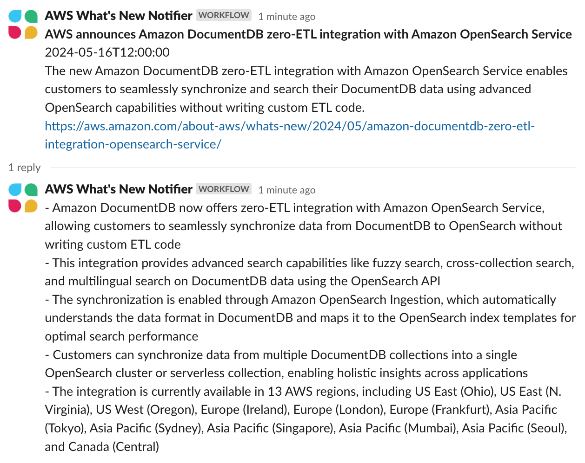
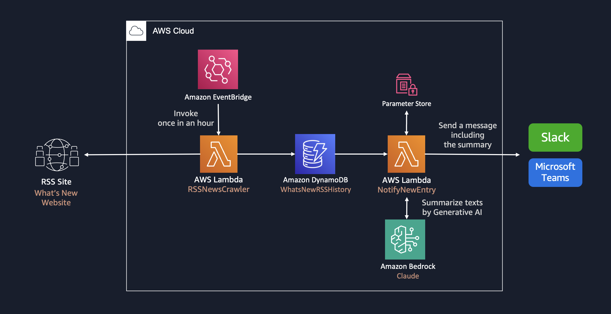

# Whats New Summary Notifier

**[日本語はこちら](README_ja.md)**

**Whats New Summary Notifier** is a sample implementation of a generative AI application that summarizes the content of AWS What's New and other web articles in multiple languages when there is an update, and delivers the summary to Slack.

This application supports websites that are created with WordPress. For example, I configured related to the Formula 1 news site. You can find configurations in cdk.json.

  

## Features

- **AI-Powered Summarization**: Uses Strands Agent SDK with Amazon Bedrock models for intelligent content summarization
- **Multi-Language Support**: Configurable output in Japanese, English, and other languages
- **Automated RSS Monitoring**: Scheduled crawling of RSS feeds for new content
- **Slack Integration**: Direct delivery of summaries to Slack channels
- **Modern Dependencies**: Uses latest compatible versions of all dependencies through automatic resolution

## Architecture

This stack create following architecture.

## Technical Details

### Dependencies

The project uses the following key dependencies:

- **Strands Agent SDK**: For AI model interactions and agent-based processing
- **AWS CDK**: Infrastructure as Code using TypeScript
- **Python 3.12**: Runtime for Lambda functions
- **Docker**: Required for Lambda function builds using AWS SAM

### Lambda Functions

1. **RSS Crawler**: Monitors RSS feeds and stores new entries in DynamoDB
2. **Notify to App**: Processes new entries, generates AI summaries using Strands Agent SDK, and sends notifications to Slack

### Dependency Resolution

The project pins direct dependencies in `requirements.txt` (e.g. `package>=x.y.z`) for reproducibility and security. Transitive dependencies are resolved by pip. For audit and update steps, see [CONTRIBUTING.md](CONTRIBUTING.md#updating-dependencies).

## Prerequisites

- An environment where you can execute Unix commands (Mac, Linux, ...)
  - If you don't have such an environment, you can also use AWS Cloud9. Please refer to [Preparing the Operating Environment (AWS Cloud9)](DEPLOY.md#preparing-the-deployment-environment-aws-cloud9).
- aws-cdk
  - You can install it with `npm install -g aws-cdk`. For more details, please refer to the [AWS documentation](https://docs.aws.amazon.com/cdk/v2/guide/getting_started.html).
- Docker
  - Docker is required to build Lambda functions using the [`aws-lambda-python-alpha`](https://docs.aws.amazon.com/cdk/api/v2/docs/aws-lambda-python-alpha-readme.html) construct. Please refer to the [Docker documentation](https://docs.docker.com/engine/install/) for more information.

## Deployment

For deployment instructions including Webhook URL setup, AWS Systems Manager Parameter Store configuration, language settings, and CDK commands, see [DEPLOY.md](DEPLOY.md).

To change the model used for summarization, see [Switching the model](DEPLOY.md#switching-the-model). Both the Converse and Responses call paths stay in the function, so switching is a configuration change rather than a code change.

## Third Party Services

This code interacts with Slack which has terms published at [Terms Page (Slack)](https://slack.com/main-services-agreement), and pricing described at [Pricing Page (Slack)](https://slack.com/pricing). You should be familiar with the pricing and confirm that your use case complies with the terms before proceeding.
