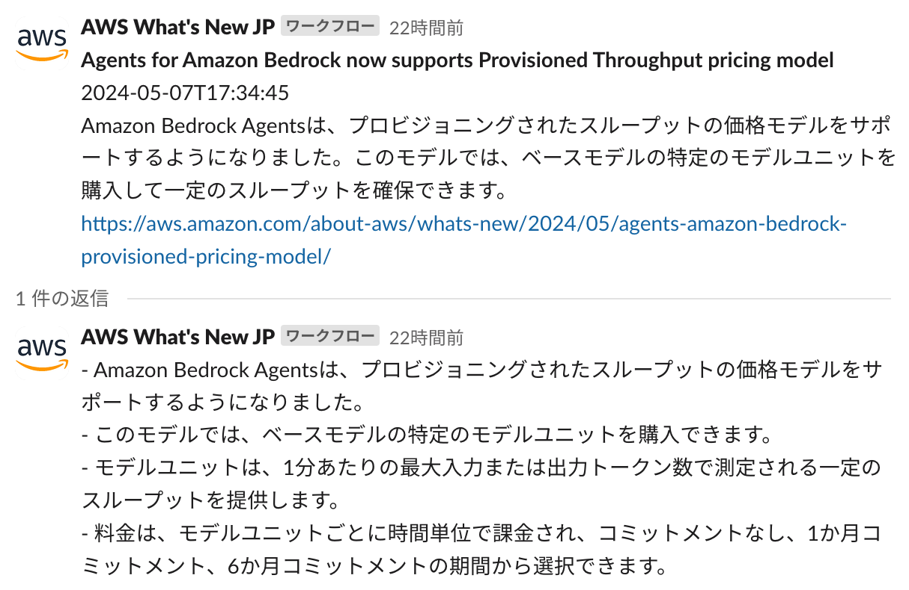

# Whats New Summary Notifier

**Whats New Summary Notifier** は、AWS 最新情報 (What's New) などのウェブ記事に更新があった際に記事内容を Amazon Bedrock で要約し、Slack への配信を行う生成 AI アプリケーションのサンプル実装です。

このアプリケーションは、WordPressで作成されたウェブサイトをサポートします。例えば、F1ニュースサイトに関連する設定を行いました。設定内容は、cdk.jsonで確認できます。

  

## 機能

- **AI駆動の要約**: Strands Agent SDKとAmazon Bedrockモデルを使用したインテリジェントなコンテンツ要約
- **多言語サポート**: 日本語、英語、その他の言語での出力設定が可能
- **自動RSS監視**: 新しいコンテンツのスケジュール化されたRSSフィードクローリング
- **Slack統合**: SlackチャンネルへのサマリーのダイレクトDelivery
- **モダンな依存関係**: 自動解決による最新の互換バージョンの依存関係を使用

## アーキテクチャ

## 技術詳細

### 依存関係

このプロジェクトでは、以下の主要な依存関係を使用しています：

- **Strands Agent SDK**: AIモデルのインタラクションとエージェントベースの処理用
- **AWS CDK**: TypeScriptを使用したInfrastructure as Code
- **Python 3.12**: Lambda関数のランタイム
- **Docker**: AWS SAMを使用したLambda関数ビルドに必要

### Lambda関数

1. **RSS Crawler**: RSSフィードを監視し、新しいエントリをDynamoDBに保存
2. **Notify to App**: 新しいエントリを処理し、Strands Agent SDKを使用してAI要約を生成し、Slackに通知を送信

### 依存関係解決

このプロジェクトでは、再現性とセキュリティのため `requirements.txt` で直接依存にバージョンを指定しています（例: `package>=x.y.z`）。推移依存は pip が解決します。監査・更新手順は [CONTRIBUTING.md](CONTRIBUTING.md#updating-dependencies) を参照してください。

## 前提条件

- Unix コマンドを実行できる環境 (Mac、Linux、...)
  - そのような環境がない場合は、AWS Cloud9 を使用することも可能です。[操作環境の準備 (AWS Cloud9)](DEPLOY_ja.md#操作環境の準備-aws-cloud9) をご参照ください。
- aws-cdk
  - `npm install -g aws-cdk` でインストール可能です。詳しくは [AWS ドキュメント](https://docs.aws.amazon.com/cdk/v2/guide/getting_started.html)を参考にしてください。
- Docker
  - [`aws-lambda-python-alpha`](https://docs.aws.amazon.com/cdk/api/v2/docs/aws-lambda-python-alpha-readme.html) コンストラクトで Lambda をビルドするために Docker が必要です。詳しくは [Docker ドキュメント](https://docs.docker.com/engine/install/)を参考にしてください。

## デプロイ

Webhook URL の設定、AWS Systems Manager Parameter Store の設定、言語設定、CDK コマンドなどデプロイ手順の詳細は [DEPLOY_ja.md](DEPLOY_ja.md) を参照してください。

## Third Party Services

このコードは 3rd Party Application である Slack と連携します。利用規約 [Terms Page (Slack)](https://slack.com/main-services-agreement) や価格設定 [Pricing Page (Slack)](https://slack.com/pricing) はこちらに公開されています。始める前に、価格設定を確認し、使用目的が利用規約に準拠していることを確認することを推奨します。
